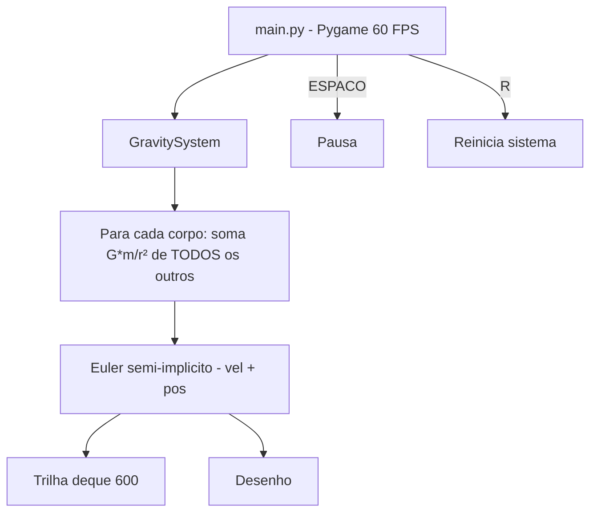

# 🌐 Gravity-Simulator — Simulador Gravitacional N-Corpos
<p align="center">
  
  <a href="https://github.com/panda12332145/Gravity-Simulator/commits/main"></a>
  <a href="https://github.com/panda12332145/Gravity-Simulator"></a>
  
</p>
---
## 🔖 Resumo

Simulador de **mecânica gravitacional newtoniana** em Pygame: N corpos se atraem mutuamente com **força vetorial somada** (G·m₁m₂/r²), integração de Euler semi-implícito, trilhas de órbita e loop estável a 60 FPS. Projeto de **física computacional** educacional com pausa e reinício em tempo real.

### ✨ Funcionalidades Principais

- ✅ N corpos com atração mútua (soma vetorial correta — funciona com 3+ corpos)
- ✅ Aceleração resultante calculada ANTES de integrar (esquema símplectico)
- ✅ Trilha de órbita com tamanho limitado (deque — sem vazamento de memória)
- ✅ 60 FPS com `pygame.time.Clock`
- ✅ Teclas: ESPAÇO pausa, R reinicia, ESC sai
- ✅ Unidades de tela com constante G ajustável

## 📽 Demonstração

```text
$ python main.py
[ janela 1024x700: Sol amarelo no centro, Terra e Lua orbitando ]
[ barra de espaço = pausa | R = reinicia | ESC = sai ]
```

## ⚙️ Explicação das Partes Importantes

### Força N-corpos (`src/system.py`)

```python
def net_acceleration(self, planet):
    ax = ay = 0.0
    for other in self.planets:
        if other is planet: continue
        dx, dy = other.pos_x - planet.pos_x, other.pos_y - planet.pos_y
        dist2 = dx*dx + dy*dy
        if dist2 < 100: continue          # corte p/ evitar singularidade
        a = G * other.mass / dist2
        ax += a * dx / math.sqrt(dist2)   # SOMA (antes: sobrescrevia!)
        ay += a * dy / math.sqrt(dist2)
    return ax, ay
```

> **Correção central:** o código original fazia `total_force = ...` (sobrescrevendo), então com 3+ corpos só a última contribuição era aplicada. Agora é soma vetorial — 3ª lei de Newton vale (testada).

### Integração (`src/planet.py`)

```python
def apply_acceleration(self, ax, ay):
    self.vel_x += ax          # 1) velocidade
    self.vel_y += ay
    self.pos_x += self.vel_x  # 2) posição (Euler semi-implícito)
    self.pos_y += self.vel_y
    self.trail.append((self.pos_x, self.pos_y))  # deque maxlen=600
```

> Euler semi-implícito é mais estável que o explícito para órbitas — e a trilha agora é limitada.

### Cena (`src/main.py`)

```python
earth = Planet("Earth", 20, 10, ..., 200, 100, 0, 0.3)
sun   = Planet("Sun", 30, 1000, ..., 512, 350, 0, 0.0)
moon  = Planet("Moon", 10, 1, ..., 250, 100, 45, 0.5)
```

> Sistema Sol–Terra–Lua de demonstração; adicione quantos corpos quiser na lista.

## 🔄 Fluxo de Trabalho / Arquitetura



## 📂 Estrutura do Projeto

```plaintext
Gravity-Simulator/
├── main.py                  # Entrada
├── src/
│   ├── planet.py            # Planet: física + trilha + desenho
│   ├── system.py            # GravitySystem: força N-corpos
│   └── main.py              # Loop Pygame (pausa/reinício)
├── tests/test_gravity.py    # 4 testes (Newt. 3ª lei, soma, trilha, smoke)
├── requirements.txt
└── README.md
```

## 🛠️ Tecnologias

| Ferramenta | Uso |
|---|---|
| **Python 3** | Linguagem |
| **Pygame** | Janela, loop e desenho |
| **Matemática** | Vetores, Newton, Euler semi-implícito |

## ▶️ Instalação

```bash
git clone https://github.com/panda12332145/Gravity-Simulator.git
cd Gravity-Simulator
pip install -r requirements.txt
```

## 🚀 Execução

```bash
python main.py

# testes (headless, sem display):
python tests/test_gravity.py
```

## 🧪 Testes

4 testes: simetria de forças (ação=reação), soma vetorial de 3 corpos (regressão do bug), trilha limitada e smoke de 30 frames com driver dummy.

## ⚠️ Limitações

- Unidades de tela (não SI) — órbitas são qualitativas
- Sem colisão/merger de corpos (corte de força perto de 10px)
- Sem campo de n-body Barnes-Hut (O(N²) puro — ok até centenas de corpos)

## 🚀 Roadmap

- [ ] Barnes-Hut para escalar milhares de corpos
- [ ] Criar corpo clicando no mouse
- [ ] Colisão/fusão de corpos
- [ ] Export de trajetória CSV

## 📄 Licença

Todos os direitos reservados ao autor.

---

## 👾 Autor

<p align="center">
  
</p>

<p align="center">Feito por <strong>Panda12332145</strong> 👋🏽</p>

---

## 🧑‍💻 Sobre Mim

Sou apaixonado por **Física Teórica, Cibersegurança e Desenvolvimento de Sistemas**. Tenho grande interesse em programação de baixo nível, engenharia reversa, automação, sistemas Windows, criptografia e segurança ofensiva. Também gosto bastante de música, filosofia e computação avançada.

---

## 🌐 Redes

* **Site:** [https://panda-h0me.netlify.app/](https://panda-h0me.netlify.app/)
* **YouTube:** [https://www.youtube.com/@X86BinaryGhost](https://www.youtube.com/@X86BinaryGhost)
* **Instagram:** [https://www.instagram.com/01pandal10/](https://www.instagram.com/01pandal10/)
* **GitHub:** [https://github.com/panda12332145](https://github.com/panda12332145)
* **LinkedIn:** [linkedin.com/in/athos-da-boanergis](https://www.linkedin.com/in/athos-d%C3%A3-boanergis-5585a4288/)

---

## 🚀 Áreas de Interesse

* **Cibersegurança Avançada** 🔒
* **Hacking & Engenharia Reversa** 💻
* **Computação de Baixo Nível** 🖥️
* **Matemática e Física Teórica** 📐⚛️
* **Desenvolvimento de Ferramentas de Segurança** 🛠️

_"Conhecimento é poder, e domínio técnico vem da compreensão profunda dos sistemas."_

---

## 📞 Contato & Suporte

Para colaborações, dúvidas ou sugestões:

📧 **E-mail:** [athos.cybersec@gmail.com](mailto:athos.cybersec@gmail.com)

🐛 **Reportar Bug:** [Abrir Issue](https://github.com/panda12332145/Gravity-Simulator/issues)

💡 **Sugerir Melhoria:** [Discussions](https://github.com/panda12332145/Gravity-Simulator/discussions)
